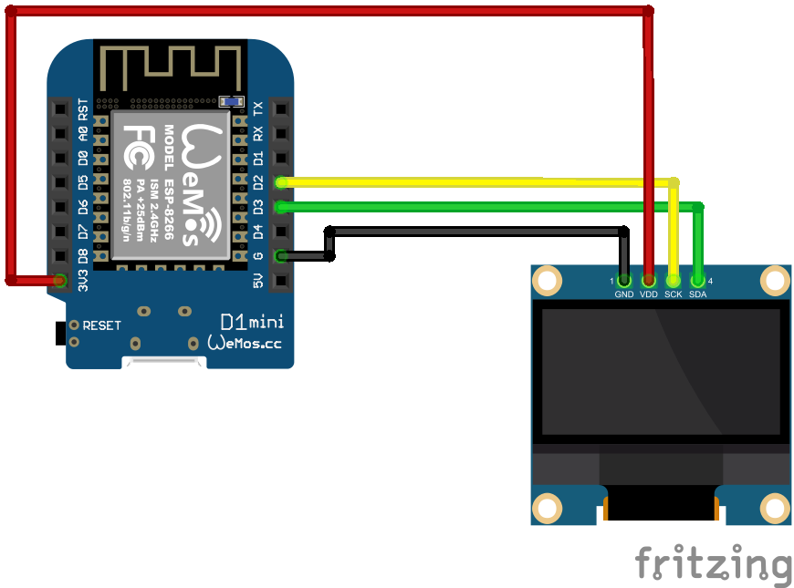

# Setup

copy and fill secrets.h

Requires [Twitch API Token](https://dev.twitch.tv/docs/authentication/getting-tokens-oauth/).

Set Streamer Name

# Hardware

 * [D1 Mini](https://www.berrybase.de/d1-mini-esp8266-entwicklungsboard)
 * [1.3 OLED](https://www.amazon.de/dp/B078J78R45)

# Wiring

